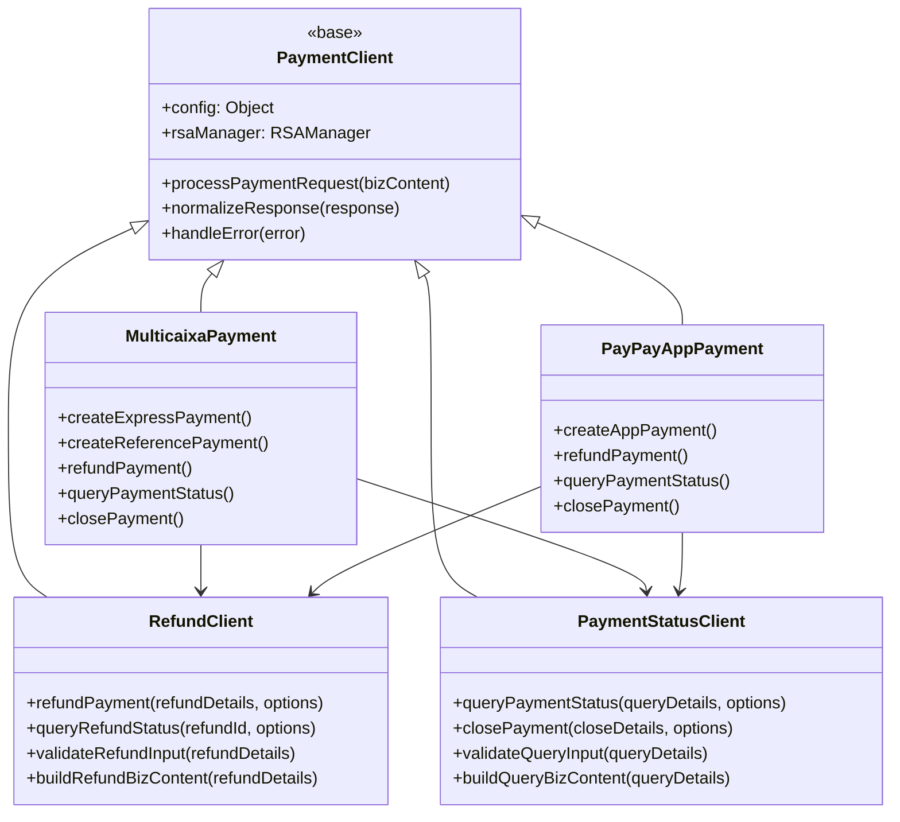
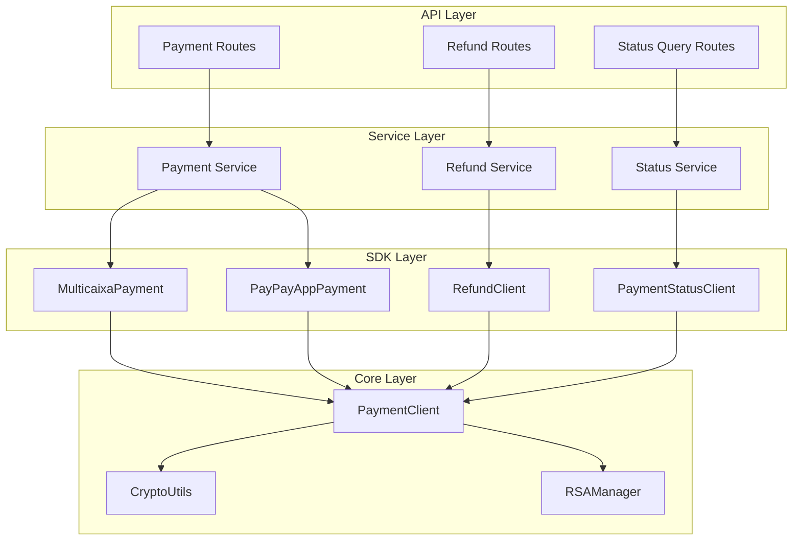
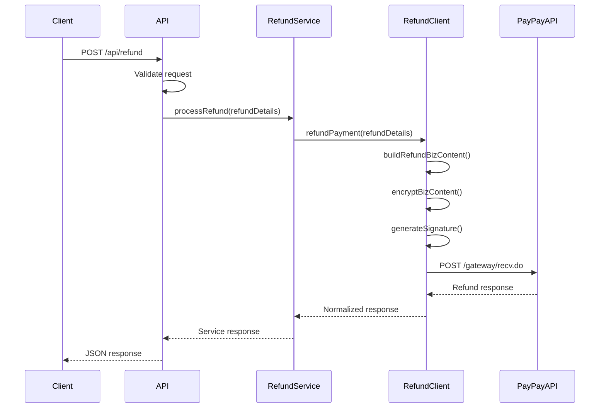
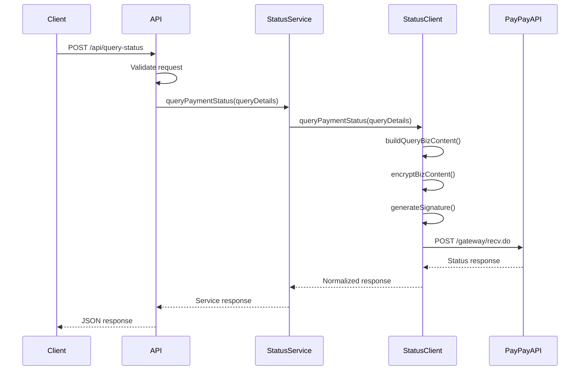
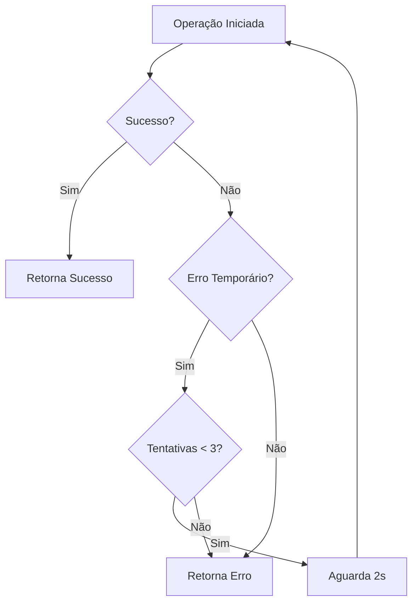

# Implementação de Funcionalidades de Refund, Close Payment e Query Payment Status

## Visão Geral

Este documento detalha a implementação das funcionalidades em falta no PayPay AO SDK, especificamente:
- **3.4 Refund Payment** - Estorno de pagamentos
- **3.5 Close Payment** - Fechamento de pagamentos
- **3.6 Query Payment Order Status** - Consulta de status de pedidos

A implementação seguirá os padrões arquiteturais existentes do SDK, baseando-se nas funcionalidades já implementadas de PayPayAppPayment e MulticaixaPayment.

## Arquitetura

### Estrutura de Classes



### Arquitetura de Componentes



## Componentes de Refund

### RefundClient

Classe especializada para operações de estorno que estende PaymentClient:

```typescript
interface RefundDetails {
    outRefundNo: string;        // Número único do estorno
    outTradeNo: string;         // Número da transação original
    refundAmount: number;       // Valor a ser estornado
    totalAmount: number;        // Valor total da transação original
    refundReason?: string;      // Motivo do estorno
}

interface RefundResponse {
    success: boolean;
    data?: {
        refundId: string;
        outRefundNo: string;
        refundAmount: number;
        refundStatus: string;
        refundTime?: string;
    };
    error?: {
        code: string;
        message: string;
    };
}
```

### Fluxo de Refund



## Componentes de Status Query

### PaymentStatusClient

Classe especializada para consultas de status e fechamento de pagamentos:

```typescript
interface QueryDetails {
    outTradeNo?: string;        // Número da transação do merchant
    tradeNo?: string;          // Número interno do PayPay
    queryType: 'PAYMENT' | 'REFUND';
}

interface CloseDetails {
    outTradeNo: string;         // Número da transação a fechar
    closeReason?: string;       // Motivo do fechamento
}

interface StatusResponse {
    success: boolean;
    data?: {
        tradeNo: string;
        outTradeNo: string;
        tradeStatus: string;
        totalAmount: number;
        payTime?: string;
        closeTime?: string;
    };
    error?: {
        code: string;
        message: string;
    };
}
```

### Fluxo de Query Status



## Endpoints da API

### POST /api/refund

**Parâmetros de Entrada:**
```json
{
    "out_trade_no": "string",      // Número da transação original
    "refund_amount": "number",     // Valor do estorno
    "total_amount": "number",      // Valor total original
    "refund_reason": "string",     // Motivo (opcional)
    "payment_type": "MULTICAIXA|PAYPAY_APP"  // Tipo de pagamento original
}
```

**Resposta de Sucesso:**
```json
{
    "success": true,
    "refund_id": "string",
    "out_refund_no": "string",
    "refund_amount": 1000.50,
    "refund_status": "PROCESSING|SUCCESS|FAILED",
    "refund_time": "2024-01-15T10:30:00Z"
}
```

### POST /api/close-payment

**Parâmetros de Entrada:**
```json
{
    "out_trade_no": "string",      // Número da transação
    "close_reason": "string",      // Motivo (opcional)
    "payment_type": "MULTICAIXA|PAYPAY_APP"
}
```

**Resposta de Sucesso:**
```json
{
    "success": true,
    "trade_no": "string",
    "out_trade_no": "string",
    "close_status": "SUCCESS|FAILED",
    "close_time": "2024-01-15T10:30:00Z"
}
```

### POST /api/query-status

**Parâmetros de Entrada:**
```json
{
    "out_trade_no": "string",      // Número da transação (opcional)
    "trade_no": "string",          // Número interno PayPay (opcional)
    "query_type": "PAYMENT|REFUND",
    "payment_type": "MULTICAIXA|PAYPAY_APP"
}
```

**Resposta de Sucesso:**
```json
{
    "success": true,
    "trade_no": "string",
    "out_trade_no": "string",
    "trade_status": "WAIT_BUYER_PAY|TRADE_SUCCESS|TRADE_CLOSED|TRADE_FINISHED",
    "total_amount": 1000.50,
    "pay_time": "2024-01-15T10:30:00Z",
    "buyer_info": {
        "phone_num": "string"      // Para MULTICAIXA
    }
}
```

## Modelos de Dados

### RefundRequest (bizContent)

```json
{
    "service": "single_trade_refund",
    "partner_id": "string",
    "out_trade_no": "string",
    "out_refund_no": "string",
    "refund_amount": "string",
    "total_amount": "string",
    "refund_reason": "string",
    "notify_url": "string"
}
```

### QueryRequest (bizContent)

```json
{
    "service": "single_trade_query",
    "partner_id": "string",
    "out_trade_no": "string",
    "trade_no": "string"
}
```

### CloseRequest (bizContent)

```json
{
    "service": "single_trade_close",
    "partner_id": "string",
    "out_trade_no": "string",
    "close_reason": "string"
}
```

## Tratamento de Erros

### Códigos de Erro Específicos

| Código | Descrição | Ação Recomendada |
|--------|-----------|------------------|
| F11001 | Transação não encontrada | Verificar out_trade_no |
| F11002 | Estorno não permitido | Verificar status da transação |
| F11003 | Valor de estorno inválido | Verificar montante |
| F11004 | Transação já estornada | Consultar status do estorno |
| F11005 | Transação já fechada | Não é possível operar |

### Estratégia de Retry



## Integração com Classes Existentes

### Extensão do MulticaixaPayment

```javascript
class MulticaixaPayment extends PaymentClient {
    // Métodos existentes...
    
    async refundPayment(refundDetails, options = {}) {
        return await this.refundClient.refundPayment(refundDetails, options);
    }
    
    async queryPaymentStatus(queryDetails, options = {}) {
        return await this.statusClient.queryPaymentStatus(queryDetails, options);
    }
    
    async closePayment(closeDetails, options = {}) {
        return await this.statusClient.closePayment(closeDetails, options);
    }
}
```

### Extensão do PayPayAppPayment

```javascript
class PayPayAppPayment extends PaymentClient {
    // Métodos existentes...
    
    async refundPayment(refundDetails, options = {}) {
        return await this.refundClient.refundPayment(refundDetails, options);
    }
    
    async queryPaymentStatus(queryDetails, options = {}) {
        return await this.statusClient.queryPaymentStatus(queryDetails, options);
    }
    
    async closePayment(closeDetails, options = {}) {
        return await this.statusClient.closePayment(closeDetails, options);
    }
}
```

## Testes Unitários

### Estrutura de Testes

```
test/unit/
├── RefundClient.test.js
├── PaymentStatusClient.test.js
├── MulticaixaRefund.test.js
├── PayPayAppRefund.test.js
├── PaymentQuery.test.js
└── integration/
    ├── RefundFlow.test.js
    ├── QueryFlow.test.js
    └── CloseFlow.test.js
```

### Casos de Teste Principais

1. **Refund Tests:**
   - Estorno parcial válido
   - Estorno total válido
   - Estorno com valor maior que original (deve falhar)
   - Estorno de transação inexistente (deve falhar)

2. **Query Tests:**
   - Consulta por out_trade_no
   - Consulta por trade_no
   - Consulta de transação inexistente

3. **Close Tests:**
   - Fechamento de transação válida
   - Fechamento de transação já paga (deve falhar)
   - Fechamento de transação inexistente (deve falhar)

## Configuração e Deployment

### Variáveis de Ambiente Adicionais

```env
# URLs específicas para novas funcionalidades
PAYPAY_REFUND_URL=https://gateway.paypayafrica.com/gateway/recv.do
PAYPAY_QUERY_URL=https://gateway.paypayafrica.com/gateway/recv.do

# Timeouts específicos
PAYPAY_REFUND_TIMEOUT=45000
PAYPAY_QUERY_TIMEOUT=30000

# Configurações de retry
PAYPAY_RETRY_ATTEMPTS=3
PAYPAY_RETRY_DELAY=2000
```

### Configuração do SDK

```javascript
const sdk = new PayPaySDK({
    // Configurações existentes...
    refundConfig: {
        maxRetries: 3,
        retryDelay: 2000,
        timeout: 45000
    },
    queryConfig: {
        maxRetries: 2,
        retryDelay: 1000,
        timeout: 30000
    }
});
```

## Considerações de Segurança

### Validações de Segurança

1. **Validação de Origem:** Verificar se a transação original pertence ao merchant
2. **Validação de Valor:** Estorno não pode exceder o valor original
3. **Validação de Status:** Só permitir estorno de transações pagas
4. **Rate Limiting:** Limitar tentativas de operações por minuto
5. **Logging:** Registrar todas as operações para auditoria

### Criptografia

- Todas as operações utilizam a mesma infraestrutura de criptografia RSA existente
- BizContent é encriptado com chave privada do merchant
- Resposta é verificada com chave pública do PayPay
- Assinatura digital garante integridade dos dados

## Monitoramento e Logging

### Métricas Importantes

- Taxa de sucesso de estornos
- Tempo médio de processamento
- Tipos de erro mais frequentes
- Volume de consultas por endpoint

### Estrutura de Logs

```json
{
    "timestamp": "2024-01-15T10:30:00Z",
    "operation": "refund|query|close",
    "payment_type": "MULTICAIXA|PAYPAY_APP",
    "out_trade_no": "string",
    "status": "success|error",
    "response_time": 1234,
    "error_code": "string",
    "user_ip": "string"
}
```