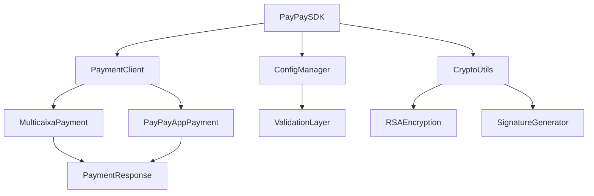

# Design de Conversão: PayPay AO Payment SDK

## Visão Geral

Este documento define a estratégia para transformar a aplicação Express.js atual em uma biblioteca/SDK reutilizável para integração de pagamentos PayPay AO, mantendo todas as funcionalidades existentes sem alterações.

### Objetivos
- Converter aplicação standalone em biblioteca distribuível via npm
- Manter todas as funcionalidades de pagamento existentes
- Fornecer API simples e intuitiva para desenvolvedores
- Preservar compatibilidade com MULTICAIXA Express e PayPay App
- Garantir mesmo nível de segurança RSA existente

## Arquitetura da Biblioteca

### Estrutura de Módulos Proposta



### Componentes Principais

#### 1. PayPaySDK (Classe Principal)
```javascript
class PayPaySDK {
  constructor(config)
  createMulticaixaPayment(orderDetails, options)
  createPayPayAppPayment(orderDetails, options)
  validateConfig()
}
```

#### 2. PaymentClient (Gerenciador de Pagamentos)
- Encapsula lógica de criação de pagamentos
- Gerencia comunicação com API PayPay
- Processa respostas e normaliza dados

#### 3. ConfigManager (Gerenciamento de Configuração)
- Validação de chaves RSA
- Gestão de credenciais merchant
- Configurações de ambiente (sandbox/produção)

#### 4. CryptoUtils (Utilitários Criptográficos)
- Funções de encriptação RSA PKCS1
- Geração de assinaturas SHA1withRSA
- Validação de chaves PEM

## Interface Pública da API

### Inicialização do SDK

```javascript
const PayPaySDK = require('@paypay-ao/payment-sdk');

const paymentClient = new PayPaySDK({
  partnerId: 'PARTNER_ID',
  privateKey: 'RSA_PRIVATE_KEY_PEM',
  paypayPublicKey: 'PAYPAY_PUBLIC_KEY_PEM',
  environment: 'sandbox' | 'production',
  language: 'pt' | 'en'
});
```

### Métodos de Pagamento

#### MULTICAIXA Express
```javascript
const multicaixaPayment = await paymentClient.createMulticaixaPayment({
  outTradeNo: 'UNIQUE_TRADE_ID',
  amount: 1000.50,
  phoneNum: '244900000000',
  paymentMethod: 'EXPRESS' | 'REFERENCE',
  subject: 'Descrição da compra'
}, {
  clientIp: '192.168.1.1'
});
```

#### PayPay App
```javascript
const appPayment = await paymentClient.createPayPayAppPayment({
  outTradeNo: 'UNIQUE_TRADE_ID',
  amount: 1000.50,
  subject: 'Descrição da compra'
}, {
  clientIp: '192.168.1.1'
});
```

### Estrutura de Resposta Normalizada

```javascript
{
  success: boolean,
  data: {
    dynamicLink: string,
    tradeToken: string,
    outTradeNo: string,
    innerTradeNo: string,
    referenceId?: string,
    entityId?: string,
    totalAmount: number,
    returnUrl: string
  },
  error?: {
    code: string,
    subCode?: string,
    message: string,
    description?: string
  }
}
```

## Migração de Componentes

### 1. Serviços de Pagamento
**Origem:** `src/services/paymentService.js`
**Destino:** `lib/payment/PaymentClient.js`

- Extrair `createPayment` → `createMulticaixaPayment`
- Extrair `createPayPayAppPayment` → mantém mesmo nome
- Adicionar tratamento de erros consistente
- Normalizar respostas da API

### 2. Utilitários Criptográficos
**Origem:** `src/utils/crypto.js`
**Destino:** `lib/crypto/CryptoUtils.js`

- Manter todas as funções existentes:
  - `encryptBizContentWithPrivateKey`
  - `generateSignature`
  - `generateRequestNo`
  - `generateTimestamp`
  - `validatePemKey`

### 3. Configuração
**Origem:** `src/config/index.js`
**Destino:** `lib/config/ConfigManager.js`

- Transformar configuração estática em classe dinâmica
- Adicionar validação de configuração
- Suporte a múltiplos ambientes

## Estrutura de Arquivos da Biblioteca

```
paypay-ao-sdk/
├── lib/
│   ├── index.js                    # Ponto de entrada principal
│   ├── PayPaySDK.js               # Classe principal do SDK
│   ├── payment/
│   │   ├── PaymentClient.js       # Cliente de pagamentos
│   │   ├── MulticaixaPayment.js   # Lógica MULTICAIXA
│   │   └── PayPayAppPayment.js    # Lógica PayPay App
│   ├── crypto/
│   │   ├── CryptoUtils.js         # Utilitários criptográficos
│   │   └── RSAManager.js          # Gerenciamento de chaves RSA
│   ├── config/
│   │   ├── ConfigManager.js       # Gerenciamento de configuração
│   │   └── environments.js        # Configurações de ambiente
│   ├── types/
│   │   └── index.d.ts             # Definições TypeScript
│   └── utils/
│       ├── validators.js          # Validadores de entrada
│       └── errors.js              # Classes de erro customizadas
├── test/
│   ├── unit/
│   └── integration/
├── docs/
│   ├── api-reference.md
│   ├── getting-started.md
│   └── examples/
├── package.json
├── README.md
└── CHANGELOG.md
```

## Configuração do Package.json

```json
{
  "name": "@paypay-ao/payment-sdk",
  "version": "1.0.0",
  "description": "SDK oficial para integração de pagamentos PayPay Angola",
  "main": "lib/index.js",
  "types": "lib/types/index.d.ts",
  "keywords": [
    "paypay",
    "payment",
    "angola",
    "multicaixa",
    "sdk",
    "payments"
  ],
  "dependencies": {
    "axios": "^1.10.0",
    "node-forge": "^1.3.1",
    "qs": "^6.14.0",
    "validator": "^13.15.15"
  },
  "peerDependencies": {
    "crypto": "^1.0.1",
    "uuid": "^11.1.0"
  },
  "engines": {
    "node": ">=16.0.0"
  }
}
```

## Implementação de Segurança

### Preservação da Criptografia Existente


### Componentes de Segurança
1. **RSA Encryption**: Manter encriptação PKCS1 em chunks de 117 bytes
2. **Digital Signature**: Preservar assinatura SHA1withRSA
3. **Timestamp Sync**: Manter sincronização GMT+1
4. **Request Validation**: Validação rigorosa de parâmetros

## Estratégia de Migração

### Fase 1: Estruturação da Biblioteca
1. Criar estrutura de diretórios da biblioteca
2. Migrar utilitários criptográficos
3. Implementar ConfigManager
4. Criar classes base PaymentClient

### Fase 2: Migração de Funcionalidades
1. Migrar lógica MULTICAIXA Express
2. Migrar lógica PayPay App
3. Implementar normalização de respostas
4. Adicionar tratamento de erros

### Fase 3: API Pública e Testes
1. Definir interface pública da API
2. Implementar validação de entrada
3. Criar suite de testes unitários
4. Testes de integração com sandbox

### Fase 4: Documentação e Distribuição
1. Documentação da API
2. Exemplos de uso
3. Configuração para publicação npm
4. Versionamento semântico

## Exemplos de Uso da Nova API

### Exemplo Completo MULTICAIXA Express
```javascript
const PayPaySDK = require('@paypay-ao/payment-sdk');

// Inicialização
const sdk = new PayPaySDK({
  partnerId: '200002914662',
  privateKey: process.env.PAYPAY_PRIVATE_KEY,
  paypayPublicKey: process.env.PAYPAY_PUBLIC_KEY,
  environment: 'production'
});

// Pagamento EXPRESS
try {
  const payment = await sdk.createMulticaixaPayment({
    outTradeNo: Date.now().toString(),
    amount: 5000.00,
    phoneNum: '244900123456',
    paymentMethod: 'EXPRESS',
    subject: 'Compra de produto'
  }, {
    clientIp: req.ip
  });
  
  if (payment.success) {
    console.log('Link de pagamento:', payment.data.dynamicLink);
    console.log('Token de transação:', payment.data.tradeToken);
  }
} catch (error) {
  console.error('Erro no pagamento:', error.message);
}
```

### Exemplo PayPay App
```javascript
// Pagamento via App
const appPayment = await sdk.createPayPayAppPayment({
  outTradeNo: 'ORDER_2024_001',
  amount: 2500.50,
  subject: 'Assinatura mensal'
}, {
  clientIp: '192.168.1.100'
});

if (appPayment.success) {
  // Exibir QR Code com payment.data.dynamicLink
  // ou redirecionar para payment.data.returnUrl
}
```

## Testes Unitários

### Estrutura de Testes
```javascript
// test/unit/PaymentClient.test.js
describe('PaymentClient', () => {
  test('deve criar pagamento MULTICAIXA EXPRESS', async () => {
    // Implementação do teste
  });
  
  test('deve criar pagamento MULTICAIXA REFERENCE', async () => {
    // Implementação do teste
  });
  
  test('deve criar pagamento PayPay App', async () => {
    // Implementação do teste
  });
});

// test/unit/CryptoUtils.test.js
describe('CryptoUtils', () => {
  test('deve encriptar bizContent corretamente', () => {
    // Implementação do teste
  });
  
  test('deve gerar assinatura válida', () => {
    // Implementação do teste
  });
});
```

Esta conversão transformará a aplicação Express atual em uma biblioteca moderna e reutilizável, mantendo todas as funcionalidades de pagamento existentes enquanto fornece uma interface mais limpa e flexível para desenvolvedores integrarem pagamentos PayPay AO em suas aplicações.